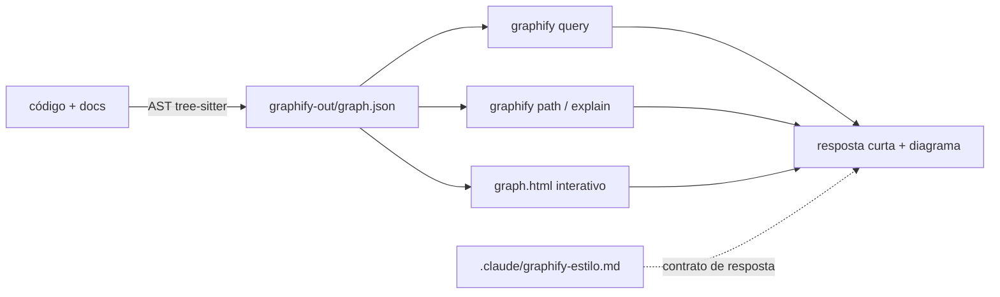

# graphify neste projeto

Mapa de conhecimento do repositório: o assistente consulta o grafo em vez de reler os
arquivos. Já está instalado e o grafo já está construído e commitado.



## O que foi instalado

| arquivo | função |
|---|---|
| `.claude/skills/graphify/SKILL.md` | a skill (comando `/graphify`) |
| `.claude/skills/graphify/references/` | fluxos detalhados: query, update, exports, hooks |
| `.claude/settings.json` | hooks `PreToolUse` — consulta o grafo antes de `Read`/`Grep` |
| `.claude/graphify-estilo.md` | **contrato de resposta**: conciso, visual, PT-BR |
| `.claude/reaplicar-estilo-graphify.py` | reaplica o contrato após um upgrade |
| `CLAUDE.md` | regras do projeto, apontando para o contrato |
| `graphify-out/` | o grafo: 121 nós, 121 arestas, 17 comunidades |

## Uso

```bash
/graphify .                                  # (re)construir tudo
/graphify query "como o upload vira tabela"  # perguntar ao grafo
graphify update .                            # após mexer no código (AST, sem custo de LLM)
graphify explain "cotar_cidade_pme"          # um nó e suas conexões
graphify path "main" "extrair_valores"       # caminho entre dois nós
open graphify-out/graph.html                 # visualização interativa
```

## Instalar na sua máquina

```bash
# 1. o pacote (uv é o caminho mais confiável; pipx e pip também servem)
uv tool install graphifyy          # ou: pipx install graphifyy

# 2. a skill, global — vale para todos os seus projetos
graphify install --platform claude

# 3. neste projeto, o contrato de resposta já vem commitado.
#    Em OUTRO projeto, copie os dois arquivos e a seção do CLAUDE.md:
#      .claude/graphify-estilo.md
#      .claude/reaplicar-estilo-graphify.py
```

O passo 2 escreve em `~/.claude/skills/graphify/`. Se você já tem a skill instalada
globalmente, a versão global e a deste repo coexistem — a do repo tem precedência aqui.

## Depois de um upgrade

`graphify install` e `uv tool upgrade graphifyy` sobrescrevem `SKILL.md` e
`references/query.md` com a versão upstream, apagando as edições do contrato de resposta.
Rode em seguida:

```bash
python3 .claude/reaplicar-estilo-graphify.py
```

Idempotente. Se um trecho upstream mudou de texto e uma âncora não bate mais, o script
falha dizendo **qual** — aí é só atualizar a âncora dentro do próprio script.

## Custo

Corpus só de código é 100% AST local: **sem chave de API e sem custo**. Extração semântica
(docs, PDFs, imagens) usa o próprio assistente, ou o Gemini se `GEMINI_API_KEY` estiver no
ambiente. O graphify nunca lê `ANTHROPIC_API_KEY`.

Upstream: [github.com/safishamsi/graphify](https://github.com/safishamsi/graphify) ·
versão instalada: 0.9.48
